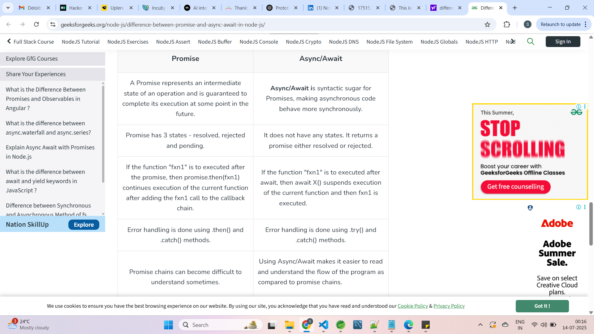

## 🔥 # *# *Most Important JavaScript Interview Questions# *# *

1. 🔥 What is the difference between `==` and `===`?
    - == : 
        - it is loose equality
        - its compares only value not a type after coercion
    - === : 
        - It is strictly equality  
        - its compares value and type of variable

5. 🔥 What is the event loop in JavaScript?
    - Event loop is a mechanism that handles aynchronous operation like setTimeout , promises etc. 
    - it runs in a single threaded enviornment and works with 
        - callstack
        - web APIs
        - callback queue 
        - Microtask queue
    - Call Stack empty → Check Microtask Queue → Check Callback Queue → Repeat

---

## 📚 # *# *Topic-wise JavaScript Interview Questions# *# *

### 🧠 JavaScript Basics

# * What is JavaScript?
    
    - javascript is a scripting language used to create dynamic content for website. It is lightweight, cross-platform and single threaded programming laguage. by default javascript executes code synchronously but it can handle aynchronous operation using callback, promise, and aync/await 
    - features : 
        - event driven 
        - dynamically typed
        - client side scripting 
        - object oriented and functional 
        - aynchronous scripting

# * What are the different data types in JavaScript?
    there are two types of data types 
        1. primitive datatyes : string, number, null, boolean, bigInt , undefined, symbol 
        2. non-primitive datatypes : array, object , function

# * What is the difference between `null` and `undefined`?
    - null : 
        - explicitly assigned a value by the programmer to indicate no value or empty
        - null means value is assigned 
    - undefined : 
        - automatically assiged by javascript 
            - when variable is declared but not assigned 
            - a function does not return value
        - variable is declared but value is not assigned yet

# * What is the use of `typeof` operator?
    - typeOf operator is used to determine the datatype 

# * What is NaN and how can you check for it? 
    - NaN stands for not a number
    - NaN appears when you perform a mathematical operation that doesn't make sense 
    

# * What are truthy and falsy values in JavaScript?
falsy : false,0,-0,null,undefined,NaN
        0n // BigInt zero
        "" // Empty string

truthy : 
    true
    "0", "false", " "   // non-empty strings
    [], {}              // empty array, object
    42, -1              // any non-zero number
    Infinity, -Infinity
    function(){}        // functions

---

### 🔁 Variables and Scope

# * What are `var`, `let`, and `const`? How do they differ?
    var : 
        - var is function scoped
        - variable declaration with var can be redeclared and reassigned 
        - it is hoisted but initialized with undefined
        - if we use var before declaration it gives undefined

    let :
        - let is blocked scoped
        - variable declaration with let can be reassigned but can't be redeclared
        - it is hoisted but not initialized ( in temporal dead zone)
        - if we use let variable  before declaration that time it will throw reference error
        (ReferenceError: Cannot access 'a' before initialization)
    const :
        - const is blocked scoped
        - variable declaration with const can't be redeclared and reassigned.
        - must be initialized at the time of declaration 
        - if we use const variable  before declaration that time it will throw reference error
        (ReferenceError: Cannot access 'a' before initialization)

# * What is hoisting in JavaScript?
    - hoisting is javascript befault behaviour of moving variables and functions are moved to the top of code before execution
    - variables are declared with var is hoisted and initialized with undefined 
    - variabled declared with let and const are hoisted but not initialized , its leading to temporal dead zone
    - functions are fully declared  

# How to Avoid Hoisting Issues in JavaScript
| Practice                          | Why it helps                    |
| --------------------------------- | ------------------------------- |
| Use `let`/`const`                 | Prevents pre-declaration access |
| Use arrow functions / expressions | Not hoisted                     |
| Declare functions before use      | Avoids confusion                |
| Avoid `var`                       | Reduces scope/hoisting issues   |
| Use `'use strict'`                | Catches silent bugs             |

# * What is scope in JavaScript?
    - scope determines where in your code you can access (read/write) variables.
    - There are 3 types of scoped 
        1. global scoped
            - In global scoped, variable declared outside any function or block 
            - accessible everywhere in code
        2. function scoped 
            - variable declared with var inside a function are accessible only within that function 
        
        3. block scoped 
            - variables declared with let and const are limited to the block ({}) where they are defined 

# * What is lexical scope?
    - Lexical scope means javascript determines variable scope based on where functions or blocks are written in code, not where they are called.

---

### 🧩 Functions

# * What is a function in JavaScript?
    - A function is a reusable block of code designed to perform a specific task. it runs only when it is called/invoked.

# * What is a callback function?
    - A callback function is a function that can passed as an argument to another function and is executed later( after some event or task)
    - used often in aynchrnous operation like setTimeout, event listeners or API calls.

# * What is an arrow function?
    - Arrow function is a shorter way to write function which are introduced in ES6.
    - 
# * What is the difference between function declaration and function expression?
    - Function declaration : 
        - function greet(){}
        - it is hoisted can be used before declartion
        - must have name
        - Not stored in variable you can stored function reference 

    - Function Expression :
        - const num = function (){} 
        - it is not hoisted must be declared 
        - can be anonymous or name
        - Assigned to a variable

# * What are higher-order functions?
    - HIgher order function is a function that can passed as an argument to another function or return new function as a result
    - higher order function are map, filter, reduce, setInterval, setTimeout

# * What are IIFEs (Immediately Invoked Function Expressions)?
    - A iife is a function that runs immediately after it is defined.
    - Ex : 
    (function(){
        console.log("In IIFE")
    })()

# * What is a closure in JavaScript?
    - closure is a function that can accessed outer function variable to its inner functions after the outer function execution has finished.
    
# What is function currying? 
    - Currying breaks down a function that takes multiple parameter into a chain function that each take one parameter 
    - Ex. 
        function sum(a){
            return function(b){
                return function(c){
                    return a+b+c;
                }
            }
        }

console.log(sum(1)(2)(3))

# Pure functions : 
    - A pure functions return the same output given the same input and has no side effects
    function add(a,b){
        return a+ b;
    }
    console.log(add(1,2))
    console.log(add(1,2))

# Impure Function
An impure function is a function that:
    - May return different results for the same input.
    - Causes side effects, such as:
        Changing a global variable
        Modifying input data
        Performing I/O operations

# Memoization 
    - Memoization is a optimization technique to cache the  results of expensive function calls 

# anonymous functions: 
    - Anonymous function is a function without a name. It is usually defined at runtime and often used as a callback or assigned to a variable

# AJAX ( Asynchronous javascript and XML): 
    - it is a technique used to send and receive data from a sever asynchronously without loading the web page\

### ⏱️ Asynchronous JavaScript

# * What is the event loop in JavaScript?
    - event loop is a mechanisum to handle code asynchronously like setTimeout,setInterval, promises,callback, async/await
    - it runs in a single threaded enviornment and works with 
        - call stack 
        - web APIs
        - callback queue 
        - microtask queue 
    - it follows flow like 
        - when call stack empty then check micostask queue then check callback queue and repeat   

+----------------------+
|     Call Stack       |
|----------------------|
|   Executes functions |
+----------|-----------+
           ↓
+-----------------------+
|  Web APIs (setTimeout)|
+----------|------------+
           ↓
+------------------+    +-----------------+
| Callback Queue   | <- | Microtask Queue |
+------------------+    +-----------------+
           ↓
     Event Loop ⟳   →  Moves tasks from queue → stack when empty

# * What is the difference between synchronous and asynchronous JavaScript?   
    - javascript is a single threaded language which means it can only execute the one task at a time.

    - Synchronous : 
        - code executed line by line if one of the code execution taking time then it waits to execute and block it till execution

    - Asynchronous : 
        - non blocking execution 
        - to use javascript as asynchronous then use callback, promise or asyn/await
        - 
# * What is `setTimeout` and `setInterval`?
    - setTimeout : 
        - setTimeout is a in built  function that executes a function once after a specified delay
        - setTimeout(callback, delay);
        - to clear event used clearTimeout(timerId)
        - Ex. 
            setTimeout(()=>{
                console.log
            },1000) //executes only once
        - to stop them 
            const timeoutID = setTimeout(() => console.log("Will not run"), 3000);
            clearTimeout(timeoutID); // cancels it

    - setInterval : 
        - setInterval is used to repeatedly execute a function at fixed time intervals 
        - setInterval(callback, interval);
        - to clear event used clearInterval(timerId)
        - Ex. 
            setInterval(()=>{
                console.log
            },1000) // executes on every interval
        - to stop them 
            const intervalID = setInterval(() => console.log("Repeating..."), 1000);
            clearInterval(intervalID); // cancels it

# * How do JavaScript timers (`setTimeout`, `setInterval`) work internally?
    - javascript is single threaded, it handles timers using the event loop and web API's 
    - step by step process : 
        - The timer is set using setTimeout or setInterval
        - the timer is handled by the browser's Web API, not the main JS thread
        - After timers ends, the callback is placed in the callback queue. 
        - the event loop is checks if the stack is empty
        - if yes, the callback is pushed to the call stack and executed.

# asynchronus programming : 
    - Aynchonous programming allows javascript to perform long running operations (like network request, file reads, timers)
    without blocking the main thread
    
    - why it is needed : 
        - javascript is a single threaded ( one thing at a time)
            - a slow operation like fetch() or setTimeout would freeze the whole UI
            - async code allows you schedule things to run later and continue immediately
    - There are 3 ways to write asynchonous programming in javascript
        1. Callback
        2. Promise
        3. aync/await 
        - and all of this is powered by the javascript event loop under the hood.   

#       ***1. Callback : 
        - callback is a function that can passed as an argument to another function and it is executed later(usually after some aync task completes)
        - real lfe example : you order a pizza and give your phone number. WHen its ready, they call you back 
        - Drawback : if callback are nested too deeply - callback hell. its hard to read and maintain 
        - Ex : 
            function fetchData(callback) {
              setTimeout(() => {
                console.log("📦 Data fetched");
                callback("✅ Data from server");
              }, 1000);
            }

            function handleData(data) {
              console.log("Callback received:", data);
            }

            fetchData(handleData);

#    ***2. Promise : 
        - Promise is an object that represents the eventual completion or failure of an aynchronous operation
            - pending : The operation is still in process 
            - resolve :when it gets success 
            - reject : when it gets failure 
        - real time example : you order something online. they promise to deliver it. you can .then() when it arrives or .catch()if it fails. 
         - Ex :
            let promiseData = new Promise((resolve, reject)=>{
                setTimeout(()=> {
                    // resolve("Data loaded ")   
                    reject("Error occurred!");
                },2000)
            })

            promiseData
                .then(data => console.log("Promise resolved: ",data))
                .catch(error => console.log("PROMISE Rejected :",error))

#    ***3. async/await : 
        - async/await is syntactic sugar over promises 
        - it makes asynchonous code look and behave like synchronous code 
        - it helps you to write cleaner and more readable code when working with aynchronous operation like API calls, timers, file operations etc
        - real time example : Instead of waiting callback, you just pause until the delivery arises then continue.
        
        - How it works :
            - A function marked with async always returns a Promise 
            - Inside an async function, you can use await to pause execution until a Promise is resolved or rejected. 
            - await can only be used inside aync functions 

        
        function fetchData(){
            return new Promise((resolve,reject)=>{
                setTimeout(()=>{
                    //resolve("user data loaded") //Success :  user data loaded
                    reject("No data found"); //Error :  No data found
                },1000)
            })
        }

        async function displayUserData(){
            try{
                const data = await fetchData();
                console.log("Success : ", data)
            }catch(error){
                console.log("Error : ", error)
            }
        }
        displayUserData()

# * How does `async`/`await` handle errors?
    - using try catch

---

### 🛠️ Arrays and Objects

# * What are `map()`, `filter()`, and `reduce()` methods in arrays?
    - map : map is higher order function and introduce in ES6. it is used to transform each element and return a new array 
    - filter : it is used to iterate for a specific conditions only and returns a new array 
    - reduce : it is used to return a single value 

# difference between map, filter, reduce , forEach

## `map()`
    - Purpose**: Transforms each element in an array and returns a **new array**.
    - Does **not** modify the original array.
    - Always returns the **same length** as the original array.
    - Ex.
        const numbers = [1, 2, 3];
        const doubled = numbers.map(num => num * 2); // [2, 4, 6]

##  `filter()`
    - Purpose**: Filters elements based on a condition and returns a **new array** of only the elements that match.
    - Returns a **subset** of the original array.
    - Does **not** modify the original array.
    - Ex.
        const numbers = [1, 2, 3, 4, 5];
        const evens = numbers.filter(num => num % 2 === 0); // [2, 4]

## `reduce()`

    - Purpose**: Reduces the array to a **single value** by applying a function to each element, carrying over an accumulator.
    - Can be used to calculate total, average, flatten arrays, etc.
    - Can return any data type (number, object, array, etc.) 
    - Ex
        const numbers = [1, 2, 3, 4];
        const sum = numbers.reduce((acc, curr) => acc + curr, 0); // 10
        

## `forEach()`
    - Purpose**: Loops through each element for **side effects** (like logging or mutating something).
    - Returns **undefined**
    - Does **not** return a new array
    - Often used for I/O, not transformations
    - Ex
        const numbers = [1, 2, 3];
        numbers.forEach(num => console.log(num)); // 1 2 3
        

### 📊 Comparison Table

| Method      | Returns New Array?   | Return Value          | Use Case                     |
| ----------- | -------------------  | --------------------- | ---------------------------- |
| `map()`     | ✅ Yes               | New transformed array | Transform each item          |
| `filter()`  | ✅ Yes               | New filtered array    | Select specific items        |
| `reduce()`  | ❌ No (single value) | Accumulated result    | Total, aggregation, etc.     |
| `forEach()` | ❌ No                | `undefined`           | Side effects (logging, etc.) |

---

### 🧠 Summary

* Use `map()` when you want to **transform** items.
* Use `filter()` when you want to **select** items.
* Use `reduce()` when you want to **accumulate** a single result.
* Use `forEach()` when you're doing something that doesn’t require a return value.

# * What is the difference between `Array.forEach()` and `Array.map()`?
    - forEach : 
        - execute a function on each array element
        - doesn't return any value
        - Doesn't change the original array
        - used for performing side effects 

    - map : 
        - Transform each element and return a new array 
        - return a new array 
        - Doesn;t change any value 
        - used for transforming data

# * What is the difference between `Array.slice()` and `Array.splice()`?
    - slice : 
        - extract a portion of the array 
        - doesn't modified original array
        - a new shallow copy
        - array.slice(startIndex, endIndex)

    - splice : 
        - add/remove elements from the array 
        - modified original array 
        - removed element as a new array
        - array.splice(startIndex, deleteCount, item1, item2, ...)

# * What is destructuring in JavaScript?
    - destructuring allows you to unpack values from array or properties from object into distinct variables.

# * What is the spread operator and rest operator?
    - spread :
        - used to expand elements from an array or object
        - Expands elements into a list
        - In function calls, arrays, objects
        - "Expands out"
        - syntax : ...array
        - ex 
            const arr1 = [1, 2];
            const arr2 = [...arr1, 3, 4]; 
            console.log(arr2); // [1, 2, 3, 4]

    - rest : 
        - used to collect remaining elements or arguments into a new array or object
        - and Collects multiple elements into an array
        - In function parameters, destructuring
        - "Gathers in"
        - ...args
        - ex 
            <!-- 1. Rest in Array Destructuring -->
            const [first, ...rest] = [10, 20, 30, 40];
            console.log(first); // 10
            console.log(rest);  // [20, 30, 40]

            <!-- 2. Rest in Function Parameters -->
            function sum(...nums) {
              return nums.reduce((a, b) => a + b, 0);
            }
            console.log(sum(1, 2, 3)); // 6

# * How do you clone an object in JavaScript?
    - there are multiple ways to clone an object depending on whether you need a shallow copy or deep copy
    - shallow copy methods : 
        - using Object.assign()
        - using spread operator
    - deep copy methods : 
        - using libraries like lodash 
        - using JSON.parse(JSON.stringify(obj))

# * What is the difference between shallow copy and deep copy?
    - shallow copy : 
        - it copies only outer object. doesn;t copy nested object
        - its faster
            Copies primitive values (like numbers, strings) by value.
            Copies non-primitive values (objects, arrays) by reference.
            Changes to nested objects affect both original and copy.
    - deep copy : 
        - it create same object reference and copies all nested object 
        - its slower
            Copies everything, including nested objects/arrays.
            No references are shared between the original and the copy

### 🧬 Objects and Inheritance

# * How does prototypal inheritance work in JavaScript?
    - javascript uses prototypal inheritence, meaning object inherit from other objects via their [[ProtoType]]
    - concepts : 
        - every object has an internal link to another object called its prototype 
        - when you access a property on an object, javascript first checks the object itself 
            - if not found, it looks up the prototype chain until it finds the property 

# * What are the different ways to create objects in JavaScript?

| Method                      | Description                                | Inheritance From          |
| --------------------------- | ------------------------------------------ | ------------------------- |
| **1. Object literal# *# *       | Most common and simple                     | `Object.prototype`        |
| **2. `new Object()`# *# *       | Constructor-based object                   | `Object.prototype`        |
| **3. `Object.create()`# *# *    | Creates object with custom prototype       | Custom prototype          |
| **4. Constructor function# *# * | Traditional OOP-style object creation      | via `prototype` property  |
| **5. ES6 `class` syntax# *# *   | Syntactic sugar over constructor functions | via `extends` + prototype |

# * What is the purpose of the `Symbol` type in JavaScript?
    - The symbol type is a primitive data type introduced in ES6. 
    - Its main purpose is to create unique identifiers for object properties. 
    - Features : 
        - Uniqueness : Every symbol is guaraneted to be unique 
        - Avoid property name collisions: 
            - Useful in objects where you want to avoid overwriting or interfering with other properties 
        - Hidden/internal properties : 
            - symbols can be used to define non-enumerable, non-string keys, useful for defining internal object behavior (eg.Symbol.iterator)

# * What is the difference between `==` and `Object.is()`?
| Feature        | `==` (Loose Equality)                  | `Object.is()`                         |
| -------------- | ---------------------------------------| ------------------------------------- |
| Type coercion  | Yes                                    | No                                    |
| `+0` vs `-0`   | `+0 == -0` → `true`                    | `Object.is(+0, -0)` → `false`         |
| `NaN` equality | `NaN == NaN` → `false`                 | `Object.is(NaN, NaN)` → `true`        |
| General usage  | For comparisons with type coercion     | For strict, edge-case-safe comparison |
| Same as `===`? | No, `===` is similar to `Object.is()`  |
                   but not identical in edge cases. |     |

# * What is the difference between a deep freeze and a shallow freeze in JavaScript?
    - Shallow Freeze : 
        - Uses Object.freeze() on the top-level object
        - Only prevents modifications to the immediate properties, not nested object
    - Deep Freeze : 
        - Recursively applies Object.Freeze() to the object and all nested objects
        - Prevents modifications at any depth
        - Use a deep freeze when full immutability is required, such as in Redux state management.
---

### 📦 Miscellaneous

# * What is the DOM (Document Object Model)?
    - DOM stands for document object model 
    - DOM represents a web page as a tree like structure that can access and manupulate the content of the structure

# * What are JavaScript events?
    onclick, onchange, submit, mouseover, onblur, onload

# * What is event delegation in JavaScript?
    - Event delegation is a technique that can attach event listeners on parent component instead of applying event listeners  on every child component. 
    - THis works because of event bubbling : events on child elements bubble up to parent 

# what is event bubbling 
    - event bubbling is a default behaviour of javascript where an event start from child element and bubbles up to its parent element.
    - event bubbling is used for event delegation

# what is event capturing
    - event capturing is the event starts from parent element and travels down to the child elment 
    - capturing is rare used when you need to intercepts events before they reach the target.

# * What is the `this` keyword in JavaScript?
    - this refers to the object that is executing the current function 
    - its value depends on how the function is called : 
        | Context               | Value of `this`                               |
        | --------------------- | --------------------------------------------- |
        | In a method           | The object that owns the method               |
        | In a regular function | `undefined` in strict mode, else `window`     |
        | In an arrow function  | Inherits from its surrounding (lexical) scope |
        | In event handlers     | The DOM element that triggered the event      |

# * What is the difference between call, apply, and bind?
    - These three methods allow you to explicitly set the this context of a function and optionally pass arguments.
    call : 
        - invoke immediately, pass args individually with specific this 
        - Ex 
            person.greet.call(anotherPerson, 30, "New York");
            // Output: Hi, I'm Bob, 30 years old from New York.

    apply : 
        - invoke immediately , pass arguments as an array with this
        - Ex. 
            person.greet.apply(anotherPerson, [25, "London"]);
            // Output: Hi, I'm Bob, 25 years old from London.

    bind : 
        - returns a new function with bound this — does not execute immediately.
        - Ex. 
            const boundGreet = person.greet.bind(anotherPerson, 40, "Tokyo");
            boundGreet(); // Output: Hi, I'm Bob, 40 years old from Tokyo.

        
    - Use call/apply when you want to invoke immediately with a specific this.
    - Use bind when you want to save a function with a bound this to use later.

    - Ex: 
        const car = {
          brand: "Tesla",
        };
        
        function describeCar(speed) {
          console.log(`${this.brand} goes ${speed} km/h`);
        }
        
        describeCar.call(car, 150);  // Tesla goes 150 km/h
        describeCar.apply(car, [180]); // Tesla goes 180 km/h
        const boundCar = describeCar.bind(car, 200);
        boundCar(); // Tesla goes 200 km/h

# difference between promise and async/await         

# * How do you handle errors in JavaScript? (try/catch vs promises)
    1. Handling Errors with try...catch (Synchronous Code)
        - Used to catch runtime errors in synchronous code and prevent the app from crashing.
    2. Handling Errors in Promises (Asynchronous)
        - Use .catch() to handle errors that occur in asynchronous operations.
    3. Handling Errors with async/await + try...catch
        - When using async/await, wrap it in a try...catch block to catch asynchronous errors like you would with synchronous code.
    
# * What are generators in JavaScript?
    - Generator is a special function in javascript that can be paused and resumed. its define using function syntax and uses the yeild keyword to pause execution
    - uses : 
        - lazy evaluation
        - infinite sequence 
        - implementing iterators 
        - managing async flows (used with Redux-Saga)

# what is iterator
    -   an iterator is an object that defines a sequence and potentially a return value upon its completion.

# * How does optional chaining (`?.`) work in JavaScript?
    - optional chaining allows you to safely access deeply nested properties without throwing an error if a property doesn't exists. 

# * How is garbage collection handled in JavaScript?
    - javascript uses automatic garbage collection to free up memory thats no longer needed
    - works : 
        - JS engine tracks references to objects
        - if an object is no longer reachable its considered as a garbage and is automatically removed from memory

# * What is memory leak in JavaScript and how to avoid it?
    - A memory leak happens when memory that is no longer needed is not released, causing the app to use more memory over time.

# * How do you debounce or throttle a function in JavaScript?
    - Both techniques to limit the rate of function execution, often for performance 
    - Debounce : 
        execute a function only after a delay since the last call 
        used for search input, resize events
    - Throttle :
        Ensures a function is called at most once every n miliseconds.
        used for scroll, mouseevents

# SSR and CSR
    - CSR : 
        - CSR stands for client side rendering 
        - in client side its rendering location is browsers 
        - initial load speed slower
        - SEO friendliness Poor ( without additional setup)
        - interactivity : starts after JS loads 
    
    - SSR : 
        - SSR stands for server side rendering 
        - in server side its rendering location is server
        - initial load speed faster 
        - SEO friendliness good
        - Interactivity Immediate ( after HTML load)

# What are Template Literals in JavaScript?
- Template Literals (also called template strings) are a feature in ES6 that allows you to:
    - Embed variables and expressions directly inside strings.
    - Write multi-line strings easily.
    - Improve readability and string manipulation.

# What Are Object Literals in JavaScript?
- Object literals are a way to define and create plain objects using a simple and readable syntax.

# polyfill
- A polyfill is a piece of code that provides a fallback implementation for a feature that is not natively supported by a browser or environment.
- It is used to ensure that a feature works across different browsers and environments, even if the featur is not supported by all of them.
- Polyfills are often used to add support for new features in older browsers, or to add support for features that are not yet implemented in a browser.
- Polyfills can be implemented using JavaScript, and can be used to add support for features such as Array.prototype.includes(), Object.assign(), and Promise.prototype.catch().

---------------------------------------------------------------------------------------------
## **List of All Important ES6 Features**
### 🔹 1. **Block Scoped Variables**
* `let`
* `const`

### 🔹 2. **Arrow Functions**
* Shorter function syntax
* Lexical `this` binding

### 🔹 3. **Template Literals**
* String interpolation with backticks `` `Hello, ${name}` ``
* Multi-line strings

### 🔹 4. **Destructuring Assignment**
* **Object Destructuring**
* **Array Destructuring**

### 🔹 5. **Default Parameters**
* Assign default values to function parameters

### 🔹 6. **Rest and Spread Operators**
* `...rest` (in function arguments)
* `...spread` (to expand arrays/objects)

### 🔹 7. **Enhanced Object Literals**
* Shorthand properties
* Concise methods
* Computed property names

### 🔹 8. **Promises**
* Better asynchronous code handling

### 🔹 9. **Classes**
* Class declarations and expressions
* `constructor()`, `extends`, `super`

### 🔹 10. **Modules**
* `import` / `export`
* Default and named exports

### 🔹 11. **Iterators and Generators**
* `for...of` loop
* `Symbol.iterator`
* Generator functions (`function*`)

### 🔹 12. **Symbols**
* Unique and immutable primitive data type

### 🔹 13. **Map and Set**

* `Map`: key-value pairs
* `Set`: unique values

### 🔹 14. **WeakMap and WeakSet**
* Similar to `Map`/`Set` but with weak references (not enumerable)

### 🔹 15. **New Built-in Methods**

#### Array:

* `Array.from()`
* `Array.of()`
* `find()`, `findIndex()`
* `fill()`, `copyWithin()`

#### String:
* `includes()`
* `startsWith()`, `endsWith()`
* `repeat()`

#### Number:
* `Number.isNaN()`
* `Number.isFinite()`
* `Number.isInteger()`

#### Math:
* `Math.trunc()`, `Math.sign()`, `Math.cbrt()` and others

### 🔹 16. **Object Enhancements**
* `Object.assign()`
* `Object.is()`
* `Object.setPrototypeOf()`, `Object.getPrototypeOf()`

### 🔹 17. **Tail Call Optimization** (optional in ES6)
---------------------------------------------------------------------------------------------

# how many ways  to empty an array 
// 1. arr.length=0
// 2. arr.splice(0,arr.length)
// 3. arr=[]

# create a new array objects
| Purpose                   | Methods (examples)                             |
| ------------------------- | ---------------------------------------------- |
| Empty array               | `[]`, `new Array()`                            |
| With values               | `[1,2,3]`, `new Array(1,2,3)`, `Array.of(...)` |
| Fixed length              | `new Array(n)`, `Array(n).fill(v)`             |
| From iterable             | `Array.from(...)`                              |
| From existing array       | `[...arr]`, `arr.slice()`, `arr.map()`         |
| Programmatic construction | `Array.from({ length: n }, (_, i) => ...)`     |

# Event Propagation:
    - Event propagation is the process by which events travel through the DOM in phases when an event is triggered.
    - Phases of Event Propagation:
        - Capturing phase (top → target)
        - Target phase (event reaches target element)
        - Bubbling phase (target → top)

